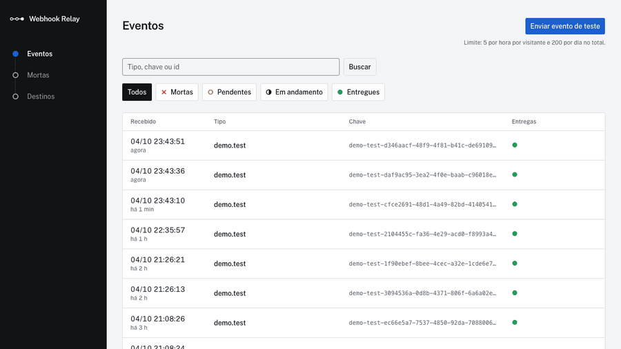
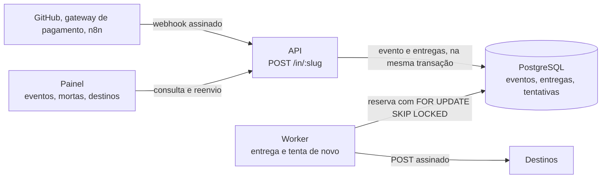
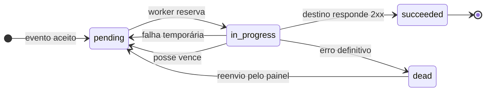
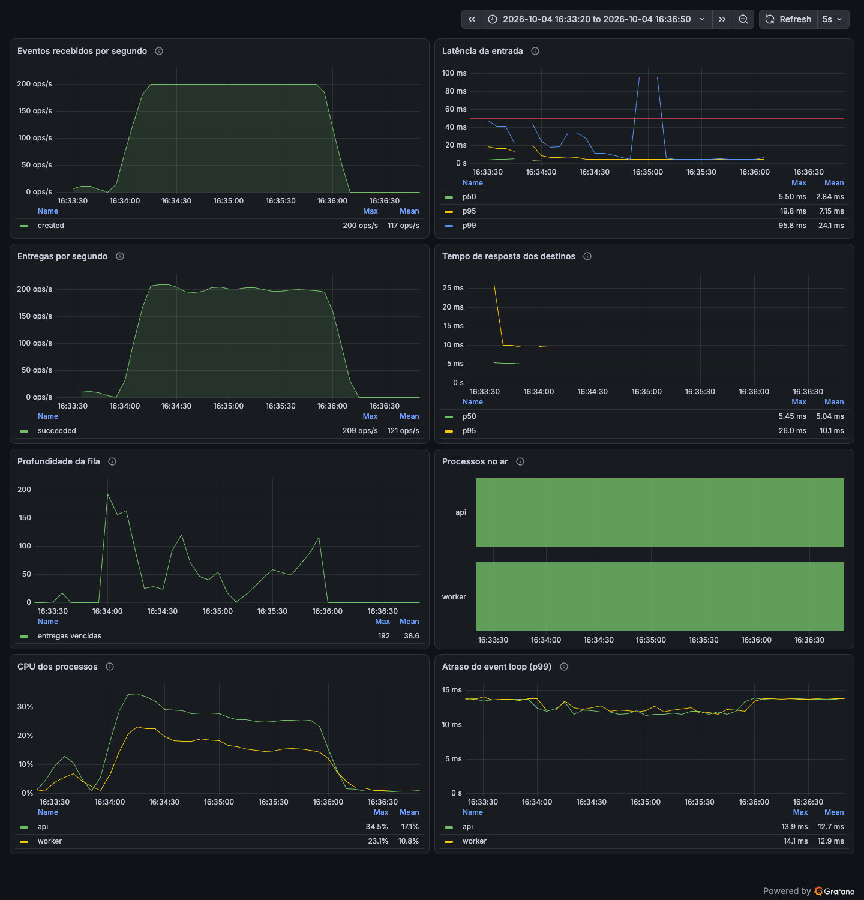
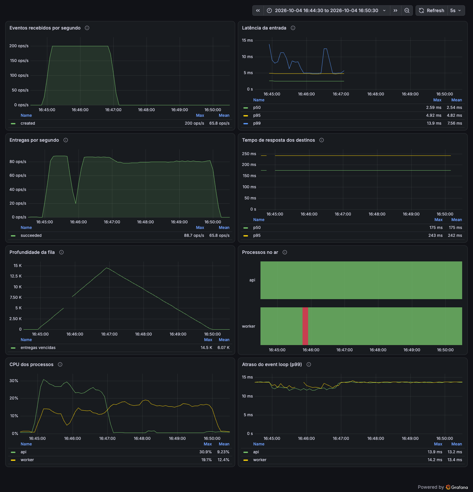

# Webhook Relay

Recebe webhooks e garante que eles chegam ao destino, mesmo quando o destino está fora do ar: guarda cada evento, entrega com novas tentativas e deixa reenviar pelo painel o que não foi entregue.

**Demonstração ao vivo:** https://relay-web-8q93.onrender.com. O botão "Enviar evento de teste" cria um evento e mostra as tentativas de entrega. O serviço roda no plano gratuito do Render e dorme quando ninguém o usa, então a primeira visita pode levar cerca de 1 minuto; o limite é de 5 testes por hora por visitante.



O destino de teste falha de propósito em 40% das vezes. Na gravação acima o relay tentou três vezes: 503, 503 depois de 5 segundos e 200 depois de mais 16 segundos. A espera cresce a cada tentativa.

## O problema

Um webhook é uma mensagem que um sistema envia a outro, sozinho, quando algo acontece: o GitHub avisa quando alguém faz um push, um gateway de pagamento avisa que o pagamento foi aprovado. Quem recebe o aviso pode estar fora do ar, lento ou com erro naquele segundo, e quem envia quase nunca insiste: o GitHub espera 10 segundos e, se falhar, não tenta de novo. O evento se perde, e a loja nunca libera o produto que o cliente pagou. O mesmo aviso também pode chegar duas vezes, ou alguém pode fingir ser o remetente.

## O que o relay faz

Ele fica entre quem envia e o seu sistema:

1. responde ao aviso em poucos milissegundos e confere a assinatura, para recusar avisos falsos;
2. grava o evento no banco, então ele não se perde mais, mesmo se tudo cair depois;
3. entrega a cada destino cadastrado, e se falhar tenta de novo, esperando mais a cada vez;
4. separa numa fila de mensagens mortas o que não conseguiu entregar, e deixa reenviar pelo painel;
5. mostra eventos, tentativas e o estado de cada destino no painel, e expõe métricas.

A garantia é de entrega **pelo menos uma vez**: todo evento aceito (resposta 202) chega ao destino, mas pode chegar duas vezes (o destino processou e a resposta se perdeu na rede). Por isso toda entrega leva um `webhook-id` que não muda entre as tentativas, e o destino precisa ignorar os repetidos. Não há garantia de ordem. A garantia começa depois do 202: se o remetente não consegue nem entregar ao relay, o relay não tem como saber.

## Como funciona



- **API** (`apps/api`): confere a assinatura em tempo constante, grava o evento e cria uma entrega para cada destino inscrito naquele tipo de evento, tudo na mesma transação. Um evento repetido responde 200 com o id original, sem duplicar: quem decide é a restrição única do banco.
- **Postgres** (`packages/db`): guarda eventos, entregas e tentativas e serve de fila. O worker reserva as entregas vencidas com `FOR UPDATE SKIP LOCKED` e marca um prazo de posse de 60 segundos; se o worker morrer, outro pega a entrega quando o prazo expira.
- **Worker** (`apps/worker`): envia o corpo exatamente como chegou, assinado com o segredo do destino, com limite de 10 segundos e sem seguir redirecionamentos. Em produção recusa destinos que resolvem para endereços privados, de loopback ou de link-local.
- **Painel** (`apps/web`): lista os eventos, mostra a linha do tempo de tentativas de cada entrega, reenvia entregas mortas (uma ou em lote) e mostra o estado do disjuntor de cada destino.
- **Servidor de produção** (`apps/server`): junta a API, o worker e a limpeza dos dados de demonstração num só processo, porque o plano gratuito do Render não oferece worker separado. Em desenvolvimento a API e o worker rodam separados.

## O ciclo de uma entrega



| Resposta do destino                      | O que acontece                                                                                  |
| ---------------------------------------- | ----------------------------------------------------------------------------------------------- |
| 2xx                                      | entregue                                                                                        |
| 5xx, 408, tempo esgotado ou erro de rede | tenta de novo; conta como falha do destino para o disjuntor                                     |
| 429                                      | tenta de novo respeitando o `Retry-After`; não conta como falha                                 |
| 410                                      | vai para as mortas e o destino é desativado                                                     |
| outros 4xx e qualquer 3xx                | vai direto para as mortas: repetir daria a mesma resposta, e redirecionamentos não são seguidos |
| depois de 8 tentativas                   | vai para as mortas                                                                              |

A espera entre as tentativas cresce de forma exponencial, com jitter completo (um valor aleatório até o teto de cada tentativa, para os envios não se sincronizarem): teto de 10 segundos na primeira, dobrando a cada vez, até 1 hora. O disjuntor de cada destino abre depois de 5 falhas seguidas e fica aberto por 5 minutos, reagendando as entregas sem chamar o destino; depois uma única tentativa de teste decide se ele volta a fechar.

## Resultados

Medidos no meu computador, com tudo em contêineres na mesma máquina (detalhes em [Carga e caos](#carga-e-caos)):

- **200 requisições por segundo durante 2 minutos:** p95 da entrada de 3,24 ms, nenhuma falha.
- **Teste de caos:** derrubei o worker com `docker kill` no meio da carga. Zero eventos perdidos e 10 entregas duplicadas, que é o preço da garantia pelo menos uma vez.
- **Testes:** mais de 1.100, boa parte com Postgres real em contêiner (Testcontainers).

## Decisões de projeto

- **Postgres como fila, e não Redis ou RabbitMQ.** Menos peças para operar, e o evento e as suas entregas entram na mesma transação: ou o evento é aceito com todas as entregas, ou nada é gravado. O limite é volume muito alto, em que uma fila dedicada passa a valer a pena.
- **Pelo menos uma vez, e não exatamente uma vez.** Quando a resposta do destino se perde na rede, o relay não sabe se ele processou. Reenviar arrisca uma duplicada, e não reenviar arrisca perder o evento; o relay escolhe a duplicada e deixa o destino ignorar o `webhook-id` repetido.
- **Sem garantia de ordem.** Vários workers reservam entregas ao mesmo tempo, e uma entrega que falha volta mais tarde, então uma entrega posterior pode chegar antes de uma anterior. Garantir a ordem exigiria entregar um evento de cada vez por destino e custaria vazão. Quem precisa de ordem deve ordenar pelos dados do próprio evento.
- **Idempotência pelo banco.** Dois pedidos iguais ao mesmo tempo passariam juntos por um `SELECT` antes do `INSERT`; a restrição única do banco é atômica e decide sozinha.
- **O corpo é guardado como bytes.** A assinatura da origem cobre os bytes exatos, e o destino confere a nossa assinatura sobre os mesmos bytes: guardar o JSON já interpretado e serializá-lo de novo mudaria o conteúdo e quebraria as duas.

## Limites conhecidos

- No plano gratuito o serviço dorme. A primeira entrega do GitHub depois disso falha (ele espera 10 segundos e não tenta de novo sozinho) e precisa ser reenviada pelo GitHub.
- O relay só repassa ao destino o corpo, o `content-type` e os cabeçalhos `webhook-*`; os cabeçalhos da origem, como `x-github-event`, ficam guardados, mas não vão adiante. Por isso um destino se inscreve nos tipos de evento que quer receber.
- O painel mostra só o endpoint de demonstração, e não há rota de administração: endpoints e destinos são cadastrados por comando.
- A causa das rajadas de latência vistas no teste de carga não foi identificada (veja [Carga e caos](#carga-e-caos)).

## Tecnologias

Node.js 24, TypeScript, Fastify 5, PostgreSQL 17, Prisma 7, Next.js 16 com shadcn/ui, pnpm workspaces, Docker, Prometheus e Grafana, k6, Vitest com Testcontainers e GitHub Actions. Publicado no Render e no Neon, nos planos gratuitos.

## Como rodar localmente

Precisa de Node 24, pnpm 11 e Docker.

```sh
cp .env.example .env
# preencha ENCRYPTION_KEY com o resultado de: openssl rand -base64 32
# preencha DEMO_QUOTA_SALT com o resultado de: openssl rand -base64 24
docker compose up -d postgres
pnpm install
pnpm --filter @relay/db build
pnpm --filter @relay/db migrate:deploy
pnpm seed:demo                    # cria o endpoint "demo" e o destino de teste; mostra o segredo uma vez
pnpm --filter @relay/api dev
pnpm --filter @relay/worker dev   # em outro terminal
pnpm --filter @relay/web dev      # em outro terminal; abra http://localhost:3100 (por localhost, não por 127.0.0.1)
```

Para cadastrar os seus próprios endpoints e destinos:

```sh
pnpm endpoint:add --slug github --scheme github \
  --destination-url https://exemplo.com/webhook --event-types push
```

O comando imprime os segredos uma única vez; o banco só guarda a versão cifrada.

## Publicação e exemplo com n8n

- [docs/publicacao.md](docs/publicacao.md): como publicar no Render e no Neon, passo a passo, e o valor de `TRUST_PROXY` medido no Render.
- [docs/n8n.md](docs/n8n.md): o GitHub entregando eventos de push a um fluxo do n8n pelo relay, com um fluxo importável que ignora entregas repetidas. Foi testado de ponta a ponta com um n8n rodando localmente; o teste com o GitHub de verdade ainda não foi feito.

## Métricas

A API e o worker expõem `GET /metrics` no formato do Prometheus quando `METRICS_ENABLED=true` (o padrão é `false`, para uma instância pública não mostrar métricas; o `.env.example` liga para desenvolvimento).

| Métrica                         | Tipo       | Labels                                                                       | O que mede                                                     |
| ------------------------------- | ---------- | ---------------------------------------------------------------------------- | -------------------------------------------------------------- |
| `relay_events_received_total`   | contador   | `result`: `created`, `duplicate`, `invalid_signature`, `unknown_endpoint`    | requisições a `POST /in/:slug` por resultado                   |
| `relay_ingest_duration_seconds` | histograma | `status_code`                                                                | tempo para responder a entrada                                 |
| `relay_deliveries_total`        | contador   | `result`: `succeeded`, `retried`, `dead`, `postponed`, `lease_lost`, `error` | resultado de cada processamento de entrega                     |
| `relay_send_duration_seconds`   | histograma | `status_class`: `2xx`, `3xx`, `4xx`, `5xx`, `none`                           | quanto o destino demorou a responder                           |
| `relay_queue_depth`             | gauge      | nenhum                                                                       | entregas prontas para enviar agora (`NaN` se a leitura falhar) |

Os labels têm poucos valores fixos de propósito: o slug do endpoint e o id do destino vêm de fora e criariam uma série nova para cada valor. Além dessas, saem as métricas padrão do processo (CPU, memória, atraso do event loop).

Para ver os gráficos, com o banco migrado e o `DEMO_QUOTA_SALT` preenchido no `.env` (`openssl rand -base64 24`):

```sh
docker compose --profile observability up -d api worker prometheus grafana
```

O Grafana abre em http://localhost:3200/d/relay-overview (já com o dashboard de [observability/grafana/dashboards/relay.json](observability/grafana/dashboards/relay.json)) e o Prometheus em http://localhost:9090. Os dois só aceitam conexões da própria máquina.

## Carga e caos

Estes testes rodam só no computador de quem desenvolve; o serviço publicado não os executa. Os números abaixo vêm de uma execução num Mac, com a API, o worker, o Postgres, o destino de teste e o k6 em contêineres na mesma máquina (Docker com 10 CPUs e 8 GB), então medem o código e não uma rede de verdade.

```sh
docker compose --profile observability --profile load up -d api worker receiver prometheus grafana
pnpm --filter @relay/load seed      # cria o endpoint "load" e um destino que aponta para o receiver
docker compose run --rm k6          # 200 requisições por segundo durante 2 minutos (RATE e DURATION mudam isso)
pnpm --filter @relay/load unseed    # apaga os dados da carga
```

O k6 usa taxa de chegada constante (as requisições chegam no ritmo combinado mesmo que o servidor atrase, como num webhook de verdade) e cada corpo é único, para nenhum evento virar repetido. O destino de teste (`load/src/receiver.ts`) responde 200 e conta cada `webhook-id` que recebe.

### Carga: 200 requisições por segundo por 2 minutos

| Medida                               | Resultado                                                        |
| ------------------------------------ | ---------------------------------------------------------------- |
| Requisições aceitas (202)            | 24.001 de 24.001, nenhuma falha, nenhuma descartada              |
| Latência da entrada (medida pelo k6) | média 2,29 ms, mediana 1,76 ms, **p95 3,24 ms**, máximo 190,8 ms |
| Meta do projeto                      | resposta em menos de 50 ms                                       |
| Worker                               | ~200 entregas por segundo, sem acumular fila                     |
| CPU no pico                          | API 34,5% e worker 23,1% de um núcleo                            |
| Entregas no destino                  | 24.001 recebidas, 24.001 distintas, 0 repetidas                  |

O histograma do próprio servidor concorda: p95 de cerca de 4,8 ms em regime, que cai na primeira faixa do histograma (até 5 ms); como o p95 é estimado dentro da faixa, o valor exato vem do k6.

Repeti a carga mais sete vezes para olhar a cauda: o p99 ficou entre 4,7 e 6,6 ms e o máximo entre 48 e 158 ms. Entre 0,1% e 0,5% das requisições passam de 15 ms, e elas vêm em rajadas de alguns segundos, com o tempo todo gasto dentro do servidor. A causa das rajadas não foi identificada: descartei a rede, os checkpoints do Postgres, a coleta de lixo da API, a gravação síncrona em disco e uma pausa da máquina virtual do Docker. Por isso o gráfico de p99 do dashboard, que usa uma janela de 20 s, mostra um pico quando uma rajada cai nela, embora o p99 do teste inteiro seja de uns 6 ms.



### Caos: derrubar o worker no meio da carga

```sh
pnpm --filter @relay/load chaos
```

O script repete a carga acima com o destino demorando 100 ms para responder (assim há entregas em andamento), manda `docker kill` (SIGKILL, sem desligamento limpo) no worker aos 45 s, religa-o 10 s depois, espera a fila esvaziar e confere as contas.

| Medida                                                           | Resultado        |
| ---------------------------------------------------------------- | ---------------- |
| Eventos aceitos com 202                                          | 24.001           |
| Eventos gravados no banco                                        | 24.001           |
| Entregas concluídas / na fila de mortas                          | 24.001 / 0       |
| Ids distintos recebidos pelo destino                             | 24.001           |
| **Eventos perdidos**                                             | **0**            |
| **Entregas duplicadas** (mesmo `webhook-id` recebido duas vezes) | **10**           |
| p95 da entrada com o worker morto                                | no máximo 4,9 ms |

As 10 duplicadas são o lote que estava em andamento no instante do kill: o destino recebeu, o worker morreu antes de gravar o resultado, e a entrega voltou 60 s depois, quando a posse dela expirou. É o preço da garantia pelo menos uma vez, e por isso o destino precisa ignorar `webhook-id` repetido (veja abaixo). O número varia de uma execução para outra, conforme o ponto do ciclo em que o kill cai: num ensaio curto saíram 0.

O worker entrega cerca de 80 por segundo com esse destino lento, bem abaixo dos 200 da entrada, então a fila chegou a 14,5 mil entregas e levou mais 3 min 6 s para esvaziar depois do fim da carga. O motivo é que o worker envia o lote de 10 em paralelo e só reserva outro lote quando o mais lento termina; com destinos que respondem na hora (carga acima) isso não aparece. A entrada não sofre: ela só grava no banco e responde, então continua rápida mesmo com o worker fora. O vale no gráfico de entregas por segundo é o worker parado, alargado pela janela de 20 s do `rate()`.



## Verificando a assinatura de saída

Toda entrega leva três headers, no padrão [Standard Webhooks](https://github.com/standard-webhooks/standard-webhooks/blob/main/spec/standard-webhooks.md):

| Header              | Conteúdo                                                           |
| ------------------- | ------------------------------------------------------------------ |
| `webhook-id`        | id da entrega; é o mesmo em todas as tentativas                    |
| `webhook-timestamp` | segundos desde 1970; é novo a cada tentativa                       |
| `webhook-signature` | `v1,<base64>`; pode trazer várias assinaturas separadas por espaço |

A assinatura é o HMAC-SHA256, em base64, do texto `webhook-id`, ponto, `webhook-timestamp`, ponto e os bytes do corpo. A chave é o segredo do destino, que tem o formato `whsec_<base64>`: o que vem depois do prefixo, decodificado, são os bytes da chave.

Para o destino verificar:

1. Use o corpo exatamente como chegou, em bytes. Se ele for lido como JSON e serializado de novo, a assinatura deixa de bater.
2. Recuse timestamps fora de uma janela (os exemplos usam 5 minutos), para impedir que uma mensagem capturada seja reenviada depois.
3. Compare em tempo constante.
4. Guarde os `webhook-id` já processados e ignore os repetidos: é assim que o destino lida com a entrega pelo menos uma vez.

### Node

```js
import { createHmac, timingSafeEqual } from "node:crypto";

const TOLERANCE_SECONDS = 300;

// rawBody é o Buffer do corpo como chegou, antes de qualquer JSON.parse
export function verifyWebhook(secret, headers, rawBody) {
  const id = headers["webhook-id"];
  const timestamp = headers["webhook-timestamp"];
  const signatures = headers["webhook-signature"];
  if (!id || !timestamp || !signatures) {
    return false;
  }

  const ageSeconds = Math.abs(Date.now() / 1000 - Number(timestamp));
  if (!(ageSeconds <= TOLERANCE_SECONDS)) {
    return false;
  }

  const key = Buffer.from(secret.slice("whsec_".length), "base64");
  const expected = createHmac("sha256", key).update(`${id}.${timestamp}.`).update(rawBody).digest();

  return signatures.split(" ").some((entry) => {
    const [version, value] = entry.split(",");
    if (version !== "v1" || value === undefined) {
      return false;
    }
    const received = Buffer.from(value, "base64");
    return received.length === expected.length && timingSafeEqual(received, expected);
  });
}
```

Com a biblioteca oficial (`npm install standardwebhooks`), que lança um erro se algo não bater:

```js
import { Webhook } from "standardwebhooks";

const payload = new Webhook(secret).verify(rawBody, headers);
```

### Python

Precisa de Python 3.9 ou mais novo.

```python
import base64
import hashlib
import hmac
import time

TOLERANCE_SECONDS = 300


def verify_webhook(secret: str, headers: dict, raw_body: bytes) -> bool:
    # raw_body são os bytes do corpo como chegou, antes de qualquer json.loads
    msg_id = headers.get("webhook-id")
    timestamp = headers.get("webhook-timestamp")
    signatures = headers.get("webhook-signature")
    if not (msg_id and timestamp and signatures):
        return False

    try:
        age_seconds = abs(time.time() - int(timestamp))
    except ValueError:
        return False
    if age_seconds > TOLERANCE_SECONDS:
        return False

    key = base64.b64decode(secret.removeprefix("whsec_"))
    signed = f"{msg_id}.{timestamp}.".encode() + raw_body
    expected = base64.b64encode(hmac.new(key, signed, hashlib.sha256).digest())

    for entry in signatures.split(" "):
        version, _, value = entry.partition(",")
        if version == "v1" and hmac.compare_digest(value.encode(), expected):
            return True
    return False
```

Com a biblioteca oficial (`pip install standardwebhooks`), que lança `WebhookVerificationError` se algo não bater:

```python
from standardwebhooks import Webhook

payload = Webhook(secret).verify(raw_body, headers)
```

Os dois primeiros trechos de cada linguagem (as funções completas) são extraídos deste arquivo e executados pelos testes do repositório contra uma requisição montada pelo código de envio do worker, então o que está escrito aqui é o que foi verificado.
